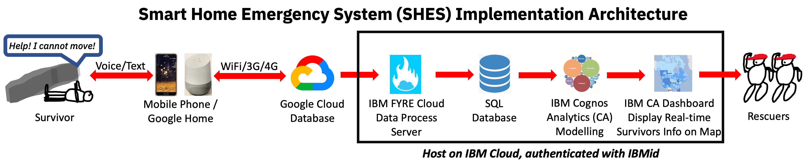
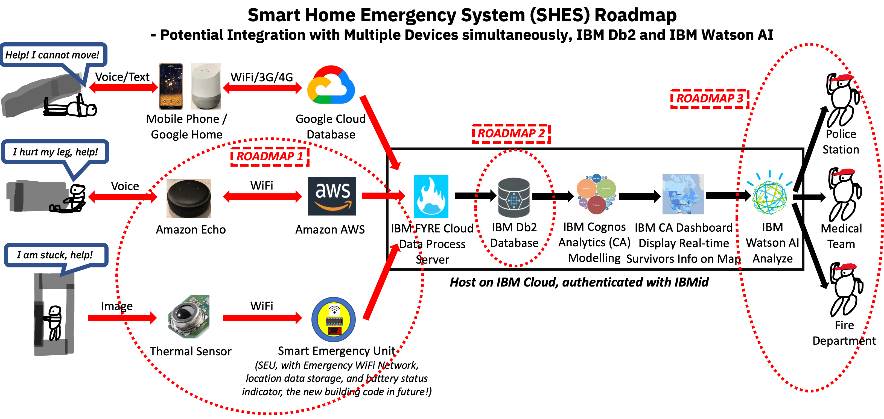
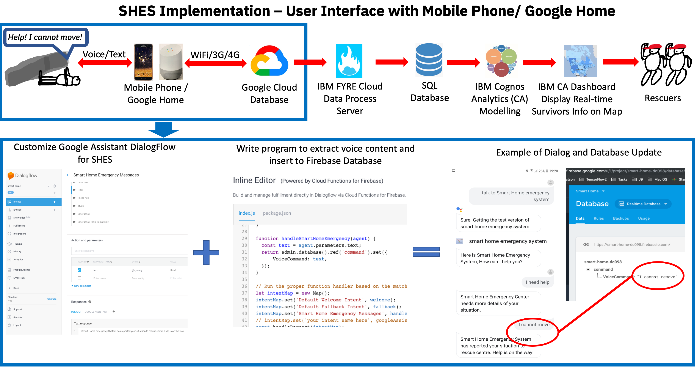
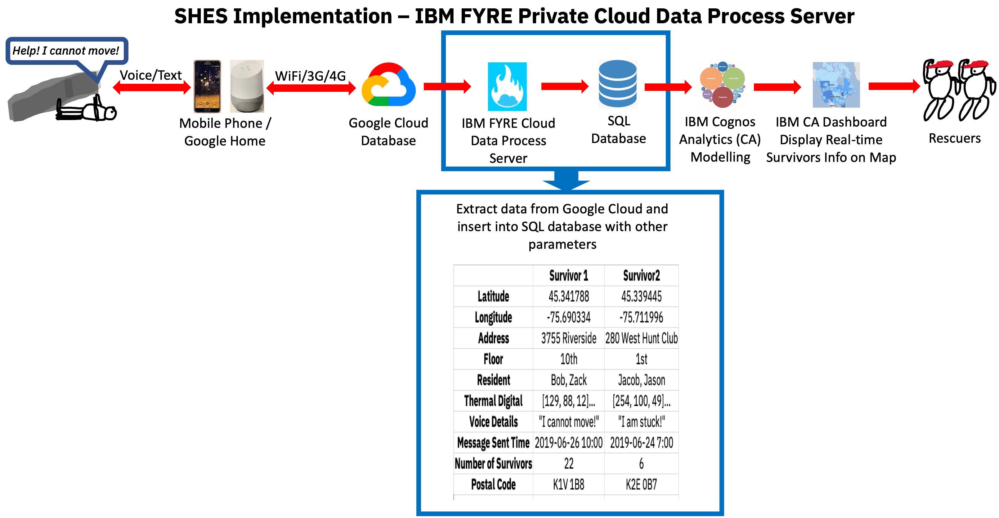
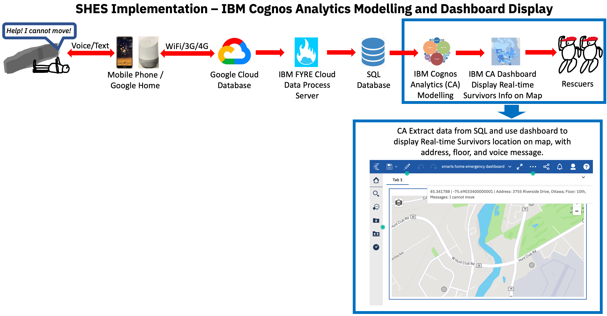

# CallForCode - Smart Home Emergency System

This is the repo for IBM Call For Code Internal team Smart Home Emergency System.

In emergencies (e.g. earthquake), currently there are no efficient ways for rescuers to communicate, locate, and evaluate survivors’ situations quickly, conveniently, and accurately, to accomplish well-planned and successful rescue works. To solve this problem, we propose and develop Smart Home Emergency System (SHES), which facilitates the rescue works during emergencies.

## Smart Home Emergency System (SHES) Architecture and Roadmap

### Implementation Architecture

Our Smart Home Emergency System (SHES) mainly consists of three components: user interface for survivors to report their situations with voice or text interaction; IBM FYRE private cloud to receive, process and store data; and IBM Cognos Analytics (CA) modelling and dashboard to display survivors’ locations and information on map. Our currently implemented system architecture is:



### Roadmap

Our proposed system also has the great potential to integrate with various devices and systems:
- Roadmap 1: SHES can work with multiple types of devices simultaneously (e.g. Amazon Echo and thermal sensor). We also plan to develop Smart Emergency Unit (SEU), which can be installed in every room (similar to smoke detector) to provide emergency WiFi connection and location information. SEU has the potential to become a new building code.
- Roadmap 2: migrate to IBM Db2 database for better scalability and flexibility.
- Roadmap 3: Integrate IBM Watson AI to analyze contents intelligently, and then report to corresponding department (e.g. police station, medical team, or fire department) directly. 



## Smart Home Emergency System (SHES) Implementation

- User Interface with Mobile Phone or Google Home

    In our implementation and demo, we used Android phone and Google Home to demonstrate the user interaction through voice commands (it also works with texts). Upon waking up Google Assistant, the user can say "Talk to Smart Home Emergency System" to enable our customized emergency conversation, which is designed with Google DialogFlow and Firebase. After the response of SHES, if user says "I need help", it will ask for more details. With further detailed reply of "I cannot move", SHES will update this content into Firebase database, and let the user know "help is on the way".

    

- IBM FYRE Private Cloud Data Process Server

    Once the previously mentioned Firebase database content updated, our IBM Cloud Data Process Server (implemented with Python) will detect the change, and update this info into our SHES database, along with other information, such as latitude, longitude, address, postal code, and voice message.

    

- IBM Cognos Analytics (CA) Modelling and Dashboard Display

    IBM Cognos Analytics will monitor the SHES database, and display survivors' locations on map based on the location information from database, with all other related information. In this way, rescuers are able to accurately locate the survivors and understand their current situations, then plan and conduct corresponding rescue works! The CA Dashboard url is [here](https://explore-r3-automation1.fyre.ibm.com:9300/bi/), and can be logged in with namespace ```LDAP```, username ```hmiller```, and password ```hillock```, then search for ```smart home emergency dashboard```.

    

With our proposed and developed Smart Home Emergency System, in emergencies, survivors can report their situations easily under various conditions, while rescuers will be able to obtain survivors’ locations, situations, and other more information conveniently, to better plan and then conduct successful rescue works to save more lives!

## Resources for SHES Project

- [Demo Video](https://ibm.box.com/s/njefkvz8elt13g1imohy9az1fzdebqxa)
- [Roadmap](https://github.ibm.com/Longyu-Zhang/CallForCode-SmartHomeEmergencySystem/blob/master/Roadmap%20of%20Smart%20Home%20Emergency%20System.png)
- [Code for Google Assistant DialogFlow and Firebase](https://github.ibm.com/Longyu-Zhang/CallForCode-SmartHomeEmergencySystem/tree/master/Code_Google_Assistant_DialogFlow_and_Firebase)
- [Code for IBM FYRE Data Process Server](https://github.ibm.com/Longyu-Zhang/CallForCode-SmartHomeEmergencySystem/tree/master/Code_IBM_Cloud_Data_Process_Server)
- [This Readme](https://github.ibm.com/Longyu-Zhang/CallForCode-SmartHomeEmergencySystem/blob/master/README.md)

## Built With
- [IBM Cognos Analytics Modelling and Dashboard](https://www.ibm.com/products/cognos-analytics)
- [IBM FYRE Private Cloud](https://fyre.ibm.com/)
- [Microsoft SQL Server](http://www.microsoft.com/SQL-Server) with Python Libraries
- [Google Assistant DialogFlow](https://cloud.google.com/dialogflow/)
- [Google Firebase](https://firebase.google.com/)

Regards,

Smart Home Emergency System Team